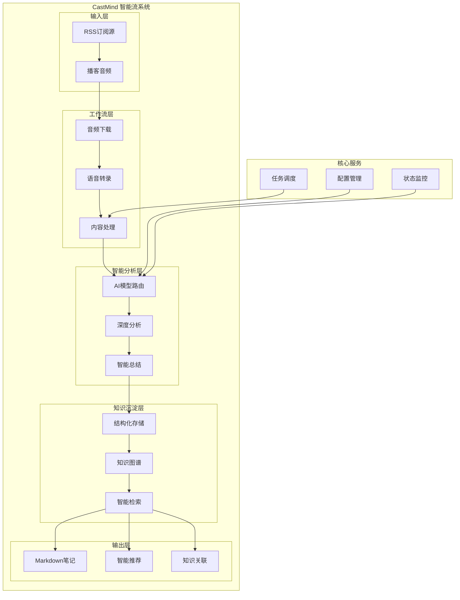

# 🧠🌊 CastMind - 播客智能流系统


> **智能流动，智慧沉淀** - 自动化播客处理、AI深度分析、知识库集成

## 🎯 核心功能

### 🧠 智能分析层
- **多AI模型路由** - DeepSeek、Kimi、OpenAI等智能选择
- **深度内容理解** - 商业洞察、关键点提取、情感分析
- **成本优化** - 智能预算控制和模型选择

### 🌊 流畅工作流
- **自动化处理** - RSS订阅、音频下载、文字转录、AI总结
- **智能调度** - 定时任务、优先级管理、错误恢复
- **状态监控** - 实时进度、性能指标、健康检查

### 📚 知识沉淀
- **结构化存储** - Markdown笔记、知识图谱、标签系统
- **智能检索** - 语义搜索、相关推荐、知识关联
- **持续学习** - 用户反馈、模型优化、知识更新

## 🚀 快速开始

### 环境要求
- Python 3.9+
- [uv](https://github.com/astral-sh/uv)（推荐）或 pip
- OpenAI API密钥（或其他AI服务密钥）
- Git

### 使用 uv 安装（推荐）

#### 1. 安装 uv
```bash
# macOS / Linux
curl -LsSf https://astral.sh/uv/install.sh | sh

# Windows
powershell -c "irm https://astral.sh/uv/install.ps1 | iex"

# 或使用 pip
pip install uv
```

#### 2. 使用 uv 初始化项目
```bash
# 克隆仓库
git clone https://github.com/YearsAlso/castmind.git
cd castmind

# 使用 uv 创建虚拟环境并安装依赖
uv venv
source .venv/bin/activate  # Linux/Mac
# 或 .venv\Scripts\activate  # Windows

# 安装依赖（uv会自动处理依赖解析和锁定）
uv pip install -r requirements.txt

# 或直接使用 uv sync（推荐）
uv sync

# 配置环境变量
cp config/.env.example config/.env
# 编辑 config/.env 文件，填入你的API密钥

# 运行测试
uv run python -m pytest tests/ -v
```

### 使用传统 pip 安装
```bash
# 克隆仓库
git clone https://github.com/YearsAlso/castmind.git
cd castmind

# 创建虚拟环境
python -m venv .venv
source .venv/bin/activate  # Linux/Mac
# 或 .venv\Scripts\activate  # Windows

# 安装依赖
pip install -r requirements.txt

# 配置环境变量
cp config/.env.example config/.env
# 编辑 .env 文件，填入你的API密钥

# 运行测试
python -m pytest tests/ -v
```

### 基础使用
```bash
# 启动CastMind系统
python castmind.py start

# 添加播客订阅
python castmind.py subscribe --name "商业思维" --url "https://example.com/rss"

# 手动处理播客
python castmind.py process --name "商业思维" --limit 3

# 查看系统状态
python castmind.py status
```

## 📁 项目架构

### 系统架构图



### 🎨 前端管理界面（新增）

CastMind 现在包含一个现代化的 Web 管理界面：

- **技术栈**: React 18 + TypeScript + Vite + Tailwind CSS
- **功能**:
  - 📊 **仪表板**: 系统概览、统计卡片、订阅源状态
  - 📰 **订阅源管理**: CRUD 操作、手动抓取、状态筛选
  - 📝 **文章管理**: 文章列表、搜索筛选、阅读状态管理
  - ⚙️ **系统管理**: 服务监控、任务调度、配置管理
- **响应式设计**: 支持移动端、平板和桌面端
- **API 集成**: 通过代理连接到后端 FastAPI 服务

**启动前端**:
```bash
cd frontend
npm install  # 或 yarn/pnpm
npm run dev  # 开发模式: http://localhost:3000
```

### 🎨 前端管理界面（新增）

CastMind 现在包含一个现代化的 Web 管理界面：

- **技术栈**: React 18 + TypeScript + Vite + Tailwind CSS
- **功能**:
  - 📊 **仪表板**: 系统概览、统计卡片、订阅源状态
  - 📰 **订阅源管理**: CRUD 操作、手动抓取、状态筛选
  - 📝 **文章管理**: 文章列表、搜索筛选、阅读状态管理
  - ⚙️ **系统管理**: 服务监控、任务调度、配置管理
- **响应式设计**: 支持移动端、平板和桌面端
- **API 集成**: 通过代理连接到后端 FastAPI 服务

**启动前端**:
```bash
cd frontend
npm install  # 或 yarn/pnpm
npm run dev  # 开发模式: http://localhost:3000
```
### 目录结构

```
castmind/
├── castmind.py              # 主入口点
├── frontend/               # 🎨 前端管理界面（新增）
│   ├── src/               # 前端源代码
│   │   ├── pages/        # 页面组件
│   │   ├── components/   # 可复用组件
│   │   ├── hooks/       # 自定义 Hooks
│   │   ├── api/         # API 接口定义
│   │   ├── App.tsx      # 主应用组件
│   │   ├── main.tsx     # 应用入口
│   │   └── index.css    # 全局样式
│   ├── public/          # 静态资源
│   ├── package.json     # 依赖配置
│   ├── vite.config.ts   # Vite 配置
│   ├── tsconfig.json    # TypeScript 配置
│   ├── tailwind.config.js # Tailwind CSS 配置
│   └── README.md        # 前端文档
├── src/                     # 源代码
│   ├── core/               # 核心模块
│   │   ├── config.py       # 配置管理
│   │   ├── scheduler.py    # 任务调度
│   │   └── monitor.py      # 状态监控
│   ├── intelligence/       # 智能层
│   │   ├── ai_router.py    # AI模型路由
│   │   ├── analyzer.py     # 内容分析
│   │   └── optimizer.py    # 成本优化
│   ├── workflow/           # 工作流层
│   │   ├── rss_parser.py   # RSS解析
│   │   ├── audio_processor.py  # 音频处理
│   │   └── note_generator.py   # 笔记生成
│   └── knowledge/          # 知识层
│       ├── storage.py      # 知识存储
│       ├── search.py       # 智能检索
│       └── graph.py        # 知识图谱
├── config/                  # 配置文件
│   ├── .env.example        # 环境变量模板
│   ├── ai_models.json      # AI模型配置
│   └── workflows.json      # 工作流配置
├── data/                   # 数据文件
│   ├── podcasts/           # 播客数据
│   ├── transcripts/        # 转录文本
│   └── knowledge/          # 知识库
├── docs/                   # 文档
│   ├── api/               # API文档
│   ├── deployment/        # 部署指南
│   ├── user-guide/        # 用户手册
│   ├── development/       # 开发指南
│   └── troubleshooting/   # 故障排除
└── tests/                  # 测试
    ├── unit/              # 单元测试
    └── integration/       # 集成测试
```

## ⚙️ 配置说明

### 环境变量 (.env)
```bash
# AI服务配置
OPENAI_API_KEY=sk-your-openai-key
DEEPSEEK_API_KEY=your-deepseek-key
KIMI_API_KEY=your-kimi-key

# 系统配置
CASTMIND_ENV=development
LOG_LEVEL=INFO
DATA_PATH=./data

# 播客配置
DEFAULT_PODCAST_LIMIT=5
AUTO_PROCESS_INTERVAL=3600  # 秒
```

### AI模型配置 (config/ai_models.json)
```json
{
  "models": {
    "deepseek": {
      "name": "DeepSeek",
      "provider": "deepseek",
      "capabilities": ["analysis", "summary", "translation"],
      "cost_per_token": 0.0000014
    },
    "kimi": {
      "name": "Kimi",
      "provider": "moonshot",
      "capabilities": ["analysis", "qa", "creative"],
      "cost_per_token": 0.0000012
    }
  }
}
```

## ⚡ uv 快速指南

### 为什么使用 uv？
- 🚀 **极速安装** - 比 pip 快 10-100 倍
- 🔒 **可靠依赖** - 内置依赖解析器和锁定文件
- 📦 **一体化工具** - 替代 pip、virtualenv、pip-tools
- 🌍 **跨平台** - 支持 Windows、macOS、Linux

### 常用 uv 命令
```bash
# 创建虚拟环境
uv venv

# 激活虚拟环境
source .venv/bin/activate  # Linux/Mac
.venv\Scripts\activate     # Windows

# 安装依赖（自动生成 uv.lock）
uv sync

# 安装开发依赖
uv sync --dev

# 运行Python脚本
uv run python script.py

# 添加新依赖
uv add package-name
uv add "package-name>=1.0.0"
uv add package-name --dev

# 移除依赖
uv remove package-name

# 更新依赖
uv sync --upgrade

# 查看依赖树
uv tree

# 导出 requirements.txt
uv pip compile pyproject.toml -o requirements.txt
```

### 项目特定的 uv 命令
```bash
# 运行CastMind系统
uv run python castmind.py start

# 运行测试
uv run pytest tests/ -v

# 代码格式化
uv run black src/
uv run isort src/

# 代码检查
uv run flake8 src/
uv run mypy src/

# 生成依赖锁定文件
uv lock

# 检查安全漏洞
uv run safety check

# 运行所有代码质量检查
uv run pre-commit run --all-files
```

### Makefile 简化命令
```bash
# 使用 Makefile 简化开发流程
make setup          # 一键设置环境（安装依赖+复制配置文件）
make install        # 安装生产依赖
make dev            # 安装开发依赖和预提交钩子
make test           # 运行测试
make lint           # 运行代码检查
make format         # 格式化代码
make check          # 运行所有检查（lint + test）
make clean          # 清理临时文件
make run            # 运行CastMind系统
make dev-run        # 开发模式运行（热重载）
make security       # 运行安全检查
make update         # 更新所有依赖
```

### uv 工作流示例
```bash
# 1. 克隆并设置项目
git clone https://github.com/YearsAlso/castmind.git
cd castmind

# 2. 使用 Makefile 一键设置
make setup

# 3. 编辑配置文件
nano config/.env  # 填入你的API密钥

# 4. 运行测试
make test

# 5. 启动系统
make run
```

## 🔧 开发指南

### 使用 uv 进行开发设置（推荐）
```bash
# 使用 uv 创建虚拟环境
uv venv

# 激活虚拟环境
source .venv/bin/activate  # Linux/Mac
# 或 .venv\Scripts\activate  # Windows

# 安装开发依赖（uv会自动处理依赖冲突）
uv sync --dev

# 或分别安装
uv pip install -r requirements.txt
uv pip install -r requirements-dev.txt

# 设置预提交钩子
uv run pre-commit install

# 运行开发服务器（热重载）
uv run python castmind.py start --reload
```

### 使用传统 pip 进行开发设置
```bash
# 创建虚拟环境
python -m venv .venv
source .venv/bin/activate  # Linux/Mac
# 或 .venv\Scripts\activate  # Windows

# 安装开发依赖
pip install -r requirements-dev.txt

# 设置预提交钩子
pre-commit install
```

### 代码规范
- 使用Black进行代码格式化
- 使用flake8进行代码检查
- 使用mypy进行类型检查
- 遵循PEP 8规范

### 提交规范
- feat: 新功能
- fix: Bug修复
- docs: 文档更新
- style: 代码格式
- refactor: 代码重构
- test: 测试相关
- chore: 构建过程

## 🐳 容器化部署

### Docker
```bash
# 构建镜像
docker build -t castmind:latest .

# 运行容器
docker run -d \
  --name castmind \
  -e OPENAI_API_KEY="your-key" \
  -v ./data:/app/data \
  castmind:latest
```

### Docker Compose
```yaml
version: '3.8'
services:
  castmind:
    build: .
    environment:
      - OPENAI_API_KEY=${OPENAI_API_KEY}
    volumes:
      - ./data:/app/data
    restart: unless-stopped
```

## 📡 推荐的 RSS 订阅源

CastMind 支持各种 RSS 订阅源，以下是一些推荐的优质内容源：

### 🎙️ 中文播客推荐

#### 科技与创业
- **科技早知道** - https://feeds.fireside.fm/techzao/rss
- **硅谷101** - https://feeds.fireside.fm/silicon101/rss
- **创业内幕** - https://feeds.fireside.fm/startupinsider/rss
- **产品沉思录** - https://feeds.fireside.fm/pmthinking/rss

#### 商业与投资
- **商业就是这样** - https://feeds.fireside.fm/businesslike/rss
- **疯投圈** - https://feeds.fireside.fm/fengtouquan/rss
- **晚点聊** - https://feeds.fireside.fm/latechat/rss
- **投资异类** - https://feeds.fireside.fm/investment/rss

#### 知识与文化
- **故事FM** - https://feeds.fireside.fm/storyfm/rss
- **文化有限** - https://feeds.fireside.fm/culturelimited/rss
- **忽左忽右** - https://feeds.fireside.fm/huzuohuyou/rss
- **随机波动** - https://feeds.fireside.fm/randomvolatility/rss

### 🌍 英文播客推荐

#### Technology & Programming
- **Software Engineering Daily** - https://softwareengineeringdaily.com/feed/podcast/
- **The Changelog** - https://changelog.com/podcast/feed
- **Syntax.fm** - https://feed.syntax.fm/rss
- **React Podcast** - https://feeds.simplecast.com/JoR28o79

#### Business & Startups
- **The Tim Ferriss Show** - https://rss.art19.com/tim-ferriss-show
- **How I Built This** - https://feeds.npr.org/510313/podcast.xml
- **Masters of Scale** - https://rss.art19.com/masters-of-scale
- **The Indicator from Planet Money** - https://feeds.npr.org/510325/podcast.xml

#### News & Analysis
- **The Daily** - https://feeds.simplecast.com/54nAGcIl
- **Up First** - https://feeds.npr.org/510318/podcast.xml
- **Today, Explained** - https://feeds.megaphone.fm/explained
- **The Journal** - https://feeds.megaphone.fm/thejournal

### 📰 新闻与资讯 RSS

#### 综合新闻
- **BBC News** - http://feeds.bbci.co.uk/news/rss.xml
- **Reuters Top News** - http://feeds.reuters.com/reuters/topNews
- **AP News** - https://feeds.apnews.com/apnews/topnews
- **CNN Top Stories** - http://rss.cnn.com/rss/cnn_topstories.rss

#### 科技新闻
- **Hacker News** - https://news.ycombinator.com/rss
- **TechCrunch** - https://techcrunch.com/feed/
- **The Verge** - https://www.theverge.com/rss/index.xml
- **Ars Technica** - http://feeds.arstechnica.com/arstechnica/index

#### 开发者资讯
- **GitHub Blog** - https://github.blog/feed/
- **Stack Overflow Blog** - https://stackoverflow.blog/feed/
- **Dev.to** - https://dev.to/feed
- **CSS-Tricks** - https://css-tricks.com/feed/

### 🎯 如何添加订阅源

#### 通过 Web 界面
1. 访问 CastMind 管理界面 (http://localhost:3000)
2. 导航到 "订阅源管理" 页面
3. 点击 "添加订阅源" 按钮
4. 输入 RSS URL 和相关信息
5. 点击保存，系统会自动开始抓取

#### 通过命令行
```bash
# 添加单个订阅源
python castmind.py subscribe --name "科技早知道" --url "https://feeds.fireside.fm/techzao/rss" --category "科技"

# 批量添加订阅源
python castmind.py subscribe-batch --file subscriptions.json

# 订阅源配置文件示例 (subscriptions.json)
[
  {
    "name": "科技早知道",
    "url": "https://feeds.fireside.fm/techzao/rss",
    "category": "科技",
    "interval": 3600
  },
  {
    "name": "商业就是这样",
    "url": "https://feeds.fireside.fm/businesslike/rss",
    "category": "商业",
    "interval": 7200
  }
]
```

#### 通过 API
```bash
# 使用 curl 添加订阅源
curl -X POST http://localhost:8000/api/v1/feeds \
  -H "Content-Type: application/json" \
  -d '{
    "name": "科技早知道",
    "url": "https://feeds.fireside.fm/techzao/rss",
    "category": "科技",
    "interval": 3600
  }'
```

### 🔧 订阅源管理技巧

#### 1. 分类管理
- 使用有意义的分类名称（如：科技、商业、文化、学习）
- 定期整理和合并相似分类
- 为每个分类设置不同的抓取频率

#### 2. 抓取优化
- **高频更新源**: 新闻类（1-2小时抓取一次）
- **中频更新源**: 博客、周刊（6-12小时抓取一次）
- **低频更新源**: 月刊、季刊（24小时抓取一次）

#### 3. 质量控制
- 定期检查订阅源状态
- 移除长期失效的订阅源
- 标记高质量内容源

#### 4. 个性化推荐
- 根据阅读历史推荐相似内容
- 标记感兴趣的主题和作者
- 设置关键词过滤

### 📊 订阅源统计示例

启动 CastMind 后，你可以在仪表板看到：
- 📈 **活跃订阅源**: 显示所有正常工作的订阅源
- 📰 **文章总数**: 所有订阅源抓取的文章数量
- 🔄 **更新频率**: 每个订阅源的抓取状态
- ⚡ **抓取性能**: 最近抓取的成功率和速度

### ❓ 常见问题

#### Q: 如何找到更多 RSS 订阅源？
A: 可以使用以下方法：
1. 在播客平台（小宇宙、Apple Podcasts）查找 RSS 链接
2. 使用 RSS 搜索引擎（如：RSS.com、Feedly）
3. 查看博客和新闻网站的底部或源代码中的 RSS 链接

#### Q: 订阅源抓取失败怎么办？
A: 检查以下问题：
1. RSS URL 是否正确
2. 网络连接是否正常
3. 订阅源是否仍然有效
4. 是否被网站限制访问

#### Q: 如何备份我的订阅源列表？
A: 使用导出功能：
```bash
# 导出订阅源列表
python castmind.py export-feeds --format json --output feeds_backup.json

# 导入订阅源列表
python castmind.py import-feeds --file feeds_backup.json
```

#### Q: 可以订阅 YouTube 频道吗？
A: 可以！使用 YouTube RSS 格式：
```
https://www.youtube.com/feeds/videos.xml?channel_id=CHANNEL_ID
```
将 `CHANNEL_ID` 替换为实际的 YouTube 频道 ID。

---

**💡 提示**: 建议从少量高质量的订阅源开始，逐渐增加。定期清理不再感兴趣的订阅源，保持信息流的质量。

## 📊 系统性能指标

### 处理能力
- **音频转录**: 1小时音频可在2-5分钟内完成转录
- **AI分析**: 平均每篇播客分析时间30-60秒
- **并发处理**: 支持同时处理10+播客源
- **知识检索**: 毫秒级语义搜索响应

### 资源消耗
- **内存使用**: 基础运行512MB，峰值2GB
- **存储空间**: 每小时音频约100MB（含转录和笔记）
- **网络带宽**: 下载音频时占用，平时几乎为0
- **CPU使用**: 转录和AI分析时峰值，其余时间空闲

### 系统监控
```bash
# 查看系统状态
python castmind.py status --detailed

# 查看处理日志
python castmind.py logs --service workflow

# 查看性能指标
python castmind.py metrics --period 24h
```

### 日志配置
```python
# config/logging.yaml
version: 1
handlers:
  console:
    class: logging.StreamHandler
    level: INFO
  file:
    class: logging.FileHandler
    filename: logs/castmind.log
    level: DEBUG
```

## 🤝 贡献指南

1. Fork项目
2. 创建功能分支 (`git checkout -b feature/amazing-feature`)
3. 提交更改 (`git commit -m 'feat: add amazing feature'`)
4. 推送到分支 (`git push origin feature/amazing-feature`)
5. 创建Pull Request

## 📄 许可证

本项目采用 MIT 许可证 - 查看 [LICENSE](LICENSE) 文件了解详情。

## 🆘 支持与反馈

- 问题报告: [GitHub Issues](https://github.com/YearsAlso/castmind/issues)
- 功能请求: [GitHub Discussions](https://github.com/YearsAlso/castmind/discussions)
- 文档: [项目Wiki](https://github.com/YearsAlso/castmind/wiki)

## ❓ 常见问题解答

### Q: CastMind支持哪些音频格式？
A: 支持MP3、M4A、WAV等常见音频格式，自动识别并转换处理。

### Q: 如何控制AI分析成本？
A: 系统内置智能成本优化器，可根据内容复杂度自动选择合适的AI模型，也支持手动设置预算上限。

### Q: 我的播客数据会被存储在哪里？
A: 所有数据本地存储，可选择上传到云端。默认存储在`./data`目录下。

### Q: 能否处理非中文播客？
A: 支持多语言识别和处理，目前支持中文、英文、日文等主要语言。

### Q: 系统需要一直运行吗？
A: 可以设置为定时任务模式，也可以常驻后台实时处理新播客。

## 🔗 社区链接

- **官方网站**: [castmind.ai](https://castmind.ai)
- **GitHub仓库**: [github.com/YearsAlso/castmind](https://github.com/YearsAlso/castmind)
- **文档中心**: [docs.castmind.ai](https://docs.castmind.ai)
- **问题反馈**: [GitHub Issues](https://github.com/YearsAlso/castmind/issues)
- **功能讨论**: [GitHub Discussions](https://github.com/YearsAlso/castmind/discussions)
- **更新动态**: [官方博客](https://blog.castmind.ai)

## 🌟 特性路线图

### 近期计划 (v1.0)
- [ ] 基础RSS解析和音频处理
- [ ] 多AI模型集成
- [ ] 基础知识存储
- [ ] Web管理界面

### 中期计划 (v2.0)
- [ ] 高级内容分析
- [ ] 知识图谱构建
- [ ] 智能推荐系统
- [ ] 移动端应用

### 长期愿景 (v3.0+)
- [ ] 个性化学习路径
- [ ] 社区知识共享
- [ ] 企业级部署
- [ ] 多语言支持

---

**CastMind - 让知识流动，让智慧沉淀** 🧠🌊